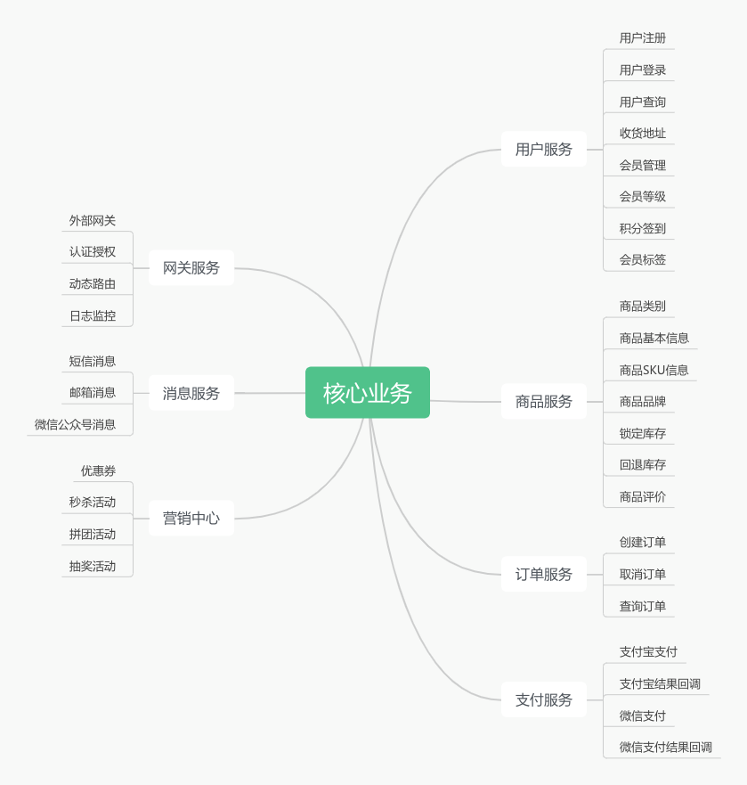

### 🎉 项目介绍

####  min-mall 商城 打造一个完整的商城体系

min-mall 商城是一个从0 到 1的 C 端商城项目，包含商城的核心业务和基础架构两大模块。

参考其他开源系统的原型，推出用户，消息，商品，订单，促销，支付，网关，购物车 等众多业务模块，通过商城系统中的复杂业务场景，给出对应的解决方案。

### 🔨 如何开始

min-mall 商城核心有两块，分别是商城业务和基础架构，通过认真学习分别可以收货以下两种能力提升

* 商城业务：学习商城核心业务，包括用户，商品，订单，促销，支付，网关，购物车 等业务模块，掌握复杂业务场景的解决方案
* 基础架构：学习商城核心基础架构，包括微服务，Spring Cloud，Spring Boot，MyBatis，MySQL，Redis，MQ

### 📚 商城业务

* 用户：用户是商城的核心，商城的一切业务都是围绕用户展开的，用户的增删改查，用户登录，用户注册，用户权限，用户积分，用户钱包，用户地址，用户收藏，用户足迹，用户分享
* 消息：消息是商城的核心，商城的一切业务都是围绕消息展开的，消息的发送，消息的接收，消息的订阅，消息的推送
* 商品：商品是商城的核心，商城的一切业务都是围绕商品展开的，商品的增删改查，商品的分类，商品的标签，商品的规格，商品的库存，商品的评论，商品的推荐，商品的搜索，商品的推荐
* 订单：订单是商城的核心，商城的一切业务都是围绕订单展开的，订单的创建，订单的取消，订单的支付，订单的退款，订单的发货，订单的收货，订单的评论，订单的推荐，订单的搜索，订单的推荐
* 促销：促销是商城的核心，商城的一切业务都是围绕促销展开的，促销的优惠券，促销的秒杀，促销的满减，促销的拼团，促销的优惠码，促销的优惠规则，促销的优惠活动，促销的优惠策略，促销的优惠规则
* 支付：支付是商城的核心，商城的一切业务都是围绕支付展开的，支付的渠道，支付的接口，支付的流程，支付的参数，支付的回调，支付的异步，支付的同步
* 网关：网关是商城的核心，商城的一切业务都是围绕网关展开的，网关的负载均衡，网关的请求转发，网关的安全防护，网关的限流熔断，网关的日志记录，网关的性能监控，网关的流量控制，网关的灰度发布，网关的路由匹配，网关的接口聚合，网关的接口聚合
* 购物车：购物车是商城的核心，商城的一切业务都是围绕购物车展开的，购物车的增删改查，购物车的分类，购物车的标签，购物车的规格，购物车的库存，购物车的评论，购物车的推荐，购物车的搜索，购物车的推荐**

### 📚 核心业务

### 📈 技术选型

---

当前暂时先梳理后端技术，前端开发后再行梳理。

|    | 技术                  | 名称                 | 官网                                                                                                 |
|----|---------------------|--------------------|----------------------------------------------------------------------------------------------------|
| 1  | Spring Boot         | 基础框架               | [https://spring.io/projects/spring-boot](https://spring.io/projects/spring-boot)                   |
| 2  | MyBatis-Plus        | 持久层框架              | [https://baomidou.com](https://baomidou.com)                                                       |
| 3  | HikariCP            | 数据库连接池             | [https://github.com/brettwooldridge/HikariCP](https://github.com/brettwooldridge/HikariCP)         |
| 4  | Redis               | 分布式缓存数据库           | [https://redis.io](https://redis.io)                                                               |
| 5  | RocketMQ            | 消息队列               | [https://rocketmq.apache.org](https://rocketmq.apache.org)                                         |
| 6  | ShardingSphere      | 数据库生态系统            | [https://shardingsphere.apache.org](https://shardingsphere.apache.org)                             |
| 7  | SpringCloud Alibaba | 分布式框架              | [https://github.com/alibaba/spring-cloud-alibaba](https://github.com/alibaba/spring-cloud-alibaba) |
| 8  | SpringCloud Gateway | 网关框架               | [https://spring.io/projects/spring-cloud-gateway](https://spring.io/projects/spring-cloud-gateway) |
| 9  | Seata               | 分布式事务框架            | [http://seata.io/zh-cn/index.html](http://seata.io/zh-cn/index.html)                               |
| 10 | Canal               | MySQL 订阅 BinLog 组件 | [https://github.com/alibaba/canal](https://github.com/alibaba/canal)                               |
| 11 | MinIO               | 文件存储框架             | [https://min.io](https://min.io)                                                                   |
| 12 | Swagger3            | 项目 API 文档框架        | [http://swagger.io](http://swagger.io)                                                             |
| 13 | Knife4j             | Swagger 增强框架       | [https://doc.xiaominfo.com](https://doc.xiaominfo.com/)                                            |
| 14 | Maven               | 项目构建管理             | [http://maven.apache.org](http://maven.apache.org)                                                 |
| 15 | Redisson            | Redis Java 客户端     | [https://redisson.org](https://redisson.org/)                                                      |
| 16 | Sentinel            | 流控防护框架             | [https://github.com/alibaba/Sentinel](https://github.com/alibaba/Sentinel)                         |
| 17 | Hippo4j             | 动态线程池框架            | [https://hippo4j.cn](https://hippo4j.cn)                                                           |
| 18 | XXL-Job             | 分布式定时任务框架          | [http://www.xuxueli.com/xxl-job](http://www.xuxueli.com/xxl-job)                                   |
| 19 | SkyWalking          | 分布式链路追踪框架          | [https://skywalking.apache.org](https://skywalking.apache.org/)                                    |
| 20 | JetCache            | Java 缓存框架          | [https://github.com/alibaba/jetcache](https://github.com/alibaba/jetcache)                                    |

### 📚 能学到什么

- 掌握SpringBoot框架
- 掌握SpringCloud框架
- 掌握SpringCloudAlibaba框架
- 掌握SpringCloudGateway网关
- 掌握SpringCloudNacos注册中心

### 📚 学习文档

[springboot 3封装自定义starter](doc/md/springboot3封装自定义starter.md)